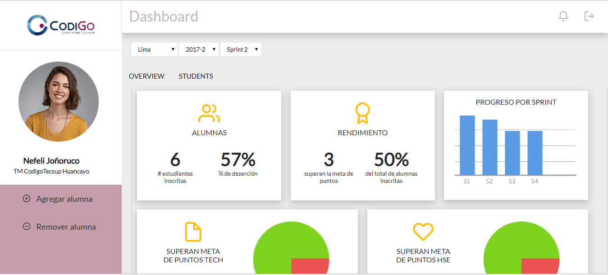
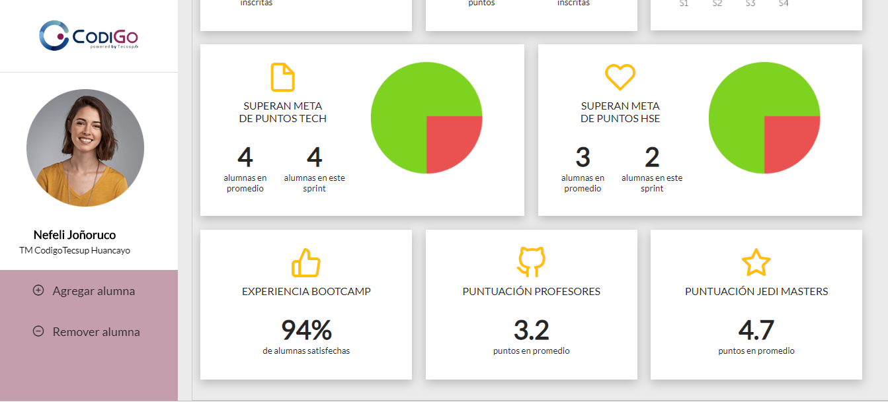

# Data Dashboard

* **Track:** _CodigoTecsup_
* **Curso:** _Creando tu primer sitio web interactivo_
* **Pareja:** _Es necesario practicar Git Colaborativo_
* **Unidad:** _Producto final_

***

## Flujo de trabajo

1. Deberás **clonar** el proyecto en tu máquina. Recuerda que el comando a usar
   es `git clone` y su estructura normalmente se ve así:

   ```bash
   git clone https://github.com/<nombre-de-usuario>/freelancer.git
   ```


> Nota: No olvides que es una buena práctica describir tu proyecto en este
> archivo `README.md`.

## OBJETIVO

> Realizar una herramienta web denominada Dashboard que permita a los docentes revisar el desempeño de los estudiantes,de modo que ellos visualizen los datos de manera fácil y rápidamente.Los items que se debe de tomar en cuenta son:

1. El total de estudiantes Activos por sede y generación. 
2. El porcentaje de deserción(Activos = false) de estudiantes. 
3. La cantidad de estudiantes que superan la meta de puntos en promedio de todos los sprints cursados. La meta de puntos es 70% del total de puntos en HSE(840) y en tech(1260). 
4. El porcentaje que representa el dato anterior en relación al total de estudiantes
5. La cantidad y el porcentaje que representa el total de estudiantes que superan la meta de puntos técnicos (tech) en promedio y por sprint.
6. La cantidad y el porcentaje que representa el total de estudiantes que superan la meta de puntos de (HSE) en promedio y por sprint.
7. El porcentaje de estudiantes satisfechas(cumple,supera) con la     experiencia del Bootcamp. 
8. La puntuación promedio de las profesores. 
9. La puntuación promedio de las jedi masters.
10. **EXTRA:** Mostrar El nombre y la foto de los estudiantes, por sede y Generacion.

## LAYOUT

; 

; 

